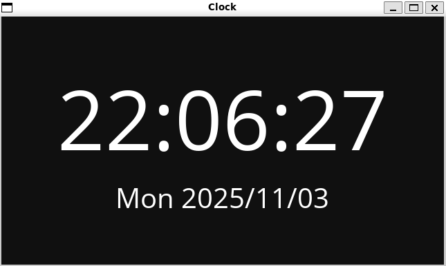

# gclock

### A gui clock written using Raylib in C.



## Features
- Displays the current time and date in a graphical interface.
- Lightweight and efficient.

## Requirements
- Raylib v5.0.0
- A C compiler (e.g., GCC) (only needed for building from source)

## Installation

### Precompiled Binaries
Precompiled binaries are available in the [Releases](https://github.com/xetri/gclock/releases) section for all major platforms. Download the appropriate binary for your platform and run the executable.

### Building from Source
To build the application for your platform, follow these steps:
1. Clone the repository:
   ```bash
   git clone https://github.com/xetri/gclock.git
   cd gclock
   make
